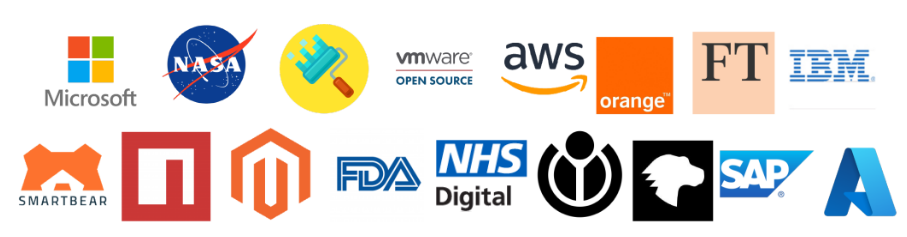

> Who says we are free! Even my free work is making money for someone.

- **Interests**: User experience (UX) and Accessibility, Product Designs 📦, Human behavior analysis and psychology, Automation, Cost-effective methods, Problem Solving
- **Beliefes**: Egalitarianism, Commonism 🌱

I've published many open-source projects like [Fast-Xml-Parser](https://github.com/NaturalIntelligence/fast-xml-parser/),  [ImgLab](https://solothought.com/imglab), [Text2Chart](https://solothought.com/text2chart/flow) etc. These are some users of my work;

## Career Aspiration
Free and open to being part of any research work. I would be lucky if it's related to nature or scientific research. Please keep me away from configuration, management, or documentation work—I have a short textual memory.

---

Looking for a second opinion or feeling bored from working on the same thing for too long? I have spare time for you. Drop me an email or message me without a second thought!

📫 You can contact me at 
- 🔗 [linkedin](https://www.linkedin.com/in/amitguptagwl/)
- 📧 githubissues@proton.me
- 🖍️ Blog: [Solothought](https://solothought.com/).

## Support

- 💰 Being an owner of a business/product you can support my work through [Github](https://github.com/sponsors/NaturalIntelligence) (Recommended), [Thanks.dev](), [OpenCollective](https://opencollective.com/fast-xml-parser/donate), [Patreon](https://www.patreon.com/Solothought), or [Paypal](https://paypal.me/naturalintelligence)
- 🧑‍🏫 **Being an individual, I would not ask you to donate money to me, but rather to support me in various ways, such as:**
  - Be my mentor or help me to learn something new (not a software for sure).
  - Supporting me in social causes.
  - Connecting me with people or groups working for social causes or who share my beliefs.
  - Being my friend—I will definitely learn something from you, and I will try to offer a different perspective on thinking.
  - Making me a part of some scientific research (not just another software project).
  - Inviting me to visit your country to experience its culture and local life.

